# Wiimote Bluetooth Connection Library for Arduino core for ESP32

This library provides C++ for connecting to and receiving data from Wiimotes and Wii Balance Boards. Controllers can be paired by passing through a manually triggered `scan()`, pressing the pair button on the device to generate a `WIIMOTE_EVENT_NEW` event, and finally `initiate_auth()` to save. After controllers are paired, they can be reconnected with only the A button or 1+2 buttons without the need for pairing. The example code demonstrates the flow shown below using a momentary button on GPIO pin 21.

## Connection Flow

```mermaid
graph TD
I[🛜 Init] --> P1[🔴 GPIO 21 Pair Button] --> S[🫱 Scan] --> P2[🔴 Wiimote Pair Button] --> N[❇️ New Connection] --> A[🤝 Auth] --> L[📝 Add To Whitelist]
I --> B[🔘A Button] --> T[❇️ Temp Connection] --> Q{📋 Check Whitelist} --pass--> C
Q --fail--> D[❌ Disconnect]
A --> C[✅ Connected]
S --timeout--> O[✋ Stop Scan]
C-->O
C--power off-->D
P1--disconnect all-->D
```

### Notes

1. Pairing is only stored on the wiimote when using the red-sync button, pairing by pressing 1 & 2 is not saved.
2. Reconnecting a paired device is easier when scanning is off.
3. Scanning for new devices is harder when other devices are still connected, hence the need to disconnect all devices before starting.
4. The maximum number of remotes that can be connected is 4 after they have been paired.

## Interpreting Data

This library does not do all of the work of interpreting the data that streams from the wiimotes & balance boards, but the example does show how to get started with some common uses. More information is found at the references below.

### References

- https://wiibrew.org/wiki/Wiimote
  - https://wiibrew.org/wiki/Wiimote/Extension_Controllers
  - https://wiibrew.org/wiki/Wii_Balance_Board
- http://www.yts.rdy.jp/pic/GB002/GB002.html
  - http://www.yts.rdy.jp/pic/GB002/hcip.html
  - http://www.yts.rdy.jp/pic/GB002/hcic.html
  - http://www.yts.rdy.jp/pic/GB002/l2cap.html
- https://qiita.com/jp-96/items/ff3822ab81f7696172c0
- https://www.wdic.org/w/WDIC/Bluetooth
  - https://www.wdic.org/w/WDIC/HCI%20%28Bluetooth%29
  - https://www.wdic.org/w/WDIC/L2CAP
